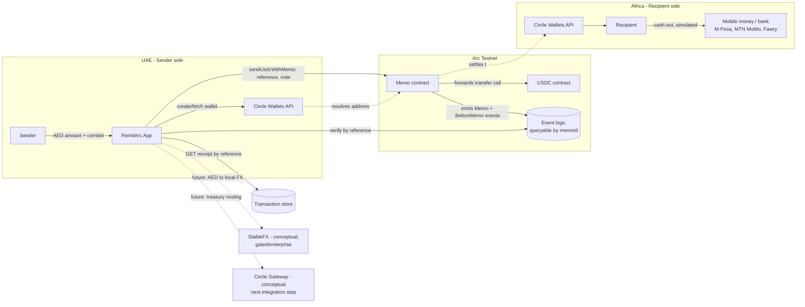

# RemitArc

**UAE → Africa remittances, settled in seconds on Arc, reconciled by reference number alone.**

Built for the Stablecoin Commerce Stack Challenge — Track 1: Best Cross-Border Payments & Remittances Experience (UAE → Global). Hosted by Ignyte, sponsored by Circle and Arc.

> Educational / testnet demo only. Not for production fund movement.

## The problem

UAE is home to over a million African expats — from Kenya, Nigeria, Ghana, Cameroon, Egypt, and more — most of whom send money home regularly. Traditional remittance rails (exchange houses, money transfer operators) typically charge 4–7% in blended fees (transaction fee + FX markup) and take 24–48 hours to settle, with Cameroon among the most expensive corridors globally per World Bank data, and reconciling "did my mother actually receive this" usually means a phone call and a reference number scribbled on a receipt.

## What RemitArc does

1. A UAE-based sender enters an amount in AED and picks a recipient corridor — Kenya (M-Pesa), Nigeria (MTN MoMo / Bank), Ghana (MTN MoMo), Cameroon (Orange Money / MTN MoMo), or Egypt (Fawry / Bank).
2. The app shows a transparent quote: USDC equivalent, RemitArc's flat fee, and a side-by-side comparison against the typical exchange-house fee and timeline for that corridor.
3. On confirmation, both sender and recipient get embedded Circle Wallets (no seed phrases, no wallet jargon - they just have an email/phone identity).
4. USDC settles on Arc in seconds, via the Memo contract, attaching a structured Arc transaction memo (memoId + memo bytes) carrying the transfer's reference number, corridor, and cash-out method.
5. The recipient gets a receipt page showing the local-currency cash-out amount and proof of settlement.
6. Anyone - sender, recipient, or RemitArc support - can later look up the transfer directly onchain by reference number, independent of RemitArc's own database, because the memo is queryable via Memo event logs.

This last point is the core differentiator: remittance disputes are usually "prove it arrived." With Arc transaction memos, that proof lives onchain and is queryable by a human-meaningful reference (e.g. RA-2026-A1B2C3), not just a raw tx hash.

## Architecture



**Where each Circle/Arc primitive is used:**

| Component | Role |
|---|---|
| Circle Wallets | Embedded, non-custodial-feeling wallets for sender and recipient, keyed by email/phone |
| USDC on Arc | Settlement currency for the transfer itself |
| Arc Memo contract | Attaches reference / corridor / cash-out method to every transfer, making it independently reconcilable onchain |
| Circle Gateway (conceptual - next step) | Would route settled USDC into a liquidity/treasury wallet that simulates the actual off-ramp to mobile money rails |
| StableFX (conceptual - gated, not requested for this submission) | Would handle AED to local-currency FX-aware routing more precisely than the static rates used in this demo |

## Project structure

```
app/
  page.tsx                          sender flow: quote -> confirm -> settle
  receive/[reference]/page.tsx      recipient receipt + onchain proof
  dashboard/page.tsx                transaction history
  api/
    quote/route.ts                  AED -> USDC + fee comparison
    wallets/route.ts                Circle Wallets create/fetch
    send/route.ts                   orchestrates wallet + Arc memo settlement
    transactions/route.ts           list all transfers
    transactions/[memoId]/route.ts  lookup one transfer by reference, with onchain verification
lib/
  arc.ts     viem client, Memo contract calls, memoId derivation, onchain lookup
  circle.ts  Circle Wallets API wrapper (falls back to deterministic mocks if unconfigured)
  fx.ts      corridor reference data + quote calculation
  store.ts   simple JSON-file transaction store (swap for a real DB post-hackathon)
components/
  CorridorTrack.tsx   visual settlement progress indicator
```

## Running locally

```bash
npm install
cp .env.example .env
npm run dev
```

The app runs fully in simulation mode with no credentials configured - lib/arc.ts and lib/circle.ts both fall back to deterministic mocks, so the full sender -> settlement -> receipt -> dashboard flow is demoable immediately.

### Going live on Arc Testnet

1. Create a wallet, fund it with testnet USDC via the Circle Faucet (https://faucet.circle.com/).
2. Set PLATFORM_PRIVATE_KEY and RPC_URL in .env.
3. Restart the dev server - sendUsdcWithMemo will now submit real Memo.memo(...) transactions and lookupByReference will query real onchain logs.

### Going live with Circle Wallets

1. Create a Circle Developer account at console.circle.com/signup.
2. Create a Wallet Set and grab CIRCLE_API_KEY, CIRCLE_ENTITY_SECRET, CIRCLE_WALLET_SET_ID.
3. Set these in .env. Verify the exact request/response shape in Circle's current Wallets API reference - lib/circle.ts is scaffolded against the documented shape but flagged with "TODO confirm" at the integration point, since API surfaces evolve.

## Deploying

```bash
vercel
```

Add the same environment variables from .env.example in the Vercel project settings before deploying live (simulation mode works without them for a safe initial deploy).

## Circle Product Feedback

**Why we chose these products:** Circle Wallets remove the single biggest UX barrier for a non-crypto-native remittance sender/recipient — seed phrases and wallet jargon. A Kenyan nurse in Dubai and her mother in Nairobi should never see a private key. Arc's Memo contract directly solves the reconciliation problem endemic to remittances: proving a transfer happened without relying on a centralized record. Every RemitArc transfer is queryable onchain by a human-readable reference number (e.g. RA-2026-A1B2C3), not just a raw tx hash.

**What worked well:** The Memo contract's pattern of wrapping the inner USDC transfer call and only emitting the Memo event on success made atomicity straightforward — we didn't need separate success/failure handling for the memo itself. Deriving a deterministic `memoId` from `keccak256(reference)` made our reconciliation logic trivial: same reference always resolves to the same memoId, no database lookup needed for verification. The Arc testnet faucet and RPC were reliable throughout development.

**What could be improved:** Arc's RPC limits `eth_getLogs` to a 10,000-block range with no pagination helper — we had to implement our own block-window logic to query recent Memo events without hitting the range error. A convenience SDK method like `getMemoEventsByReference(reference, fromBlock?)` would remove this class of integration bug entirely. Circle Wallets' exact REST payload shape for Arc-specific blockchain identifiers wasn't always unambiguous from the docs alone; a copy-pasteable "Arc + Wallets" quickstart combining both products in one repo would have saved a full day of cross-referencing.

**Recommendations:** A combined "Arc + Wallets + Memo" end-to-end sample app — sender wallet → memo-tagged USDC transfer → recipient wallet, all wired together — would be the single highest-value addition to the developer docs for this track. It's the exact stack every remittance-focused team needs, and right now it requires stitching three separate documentation pages together.

## Roadmap (post-deadline ideas, not required for submission)

- Real Circle Gateway integration for treasury routing into actual mobile money off-ramp partners.
- StableFX for live AED/KES/NGN/GHS/XAF/EGP FX rates instead of static reference rates sourced from Wise/Xe.
- CCTP/Bridge Kit if recipient settlement needs to land on a different chain than Arc.