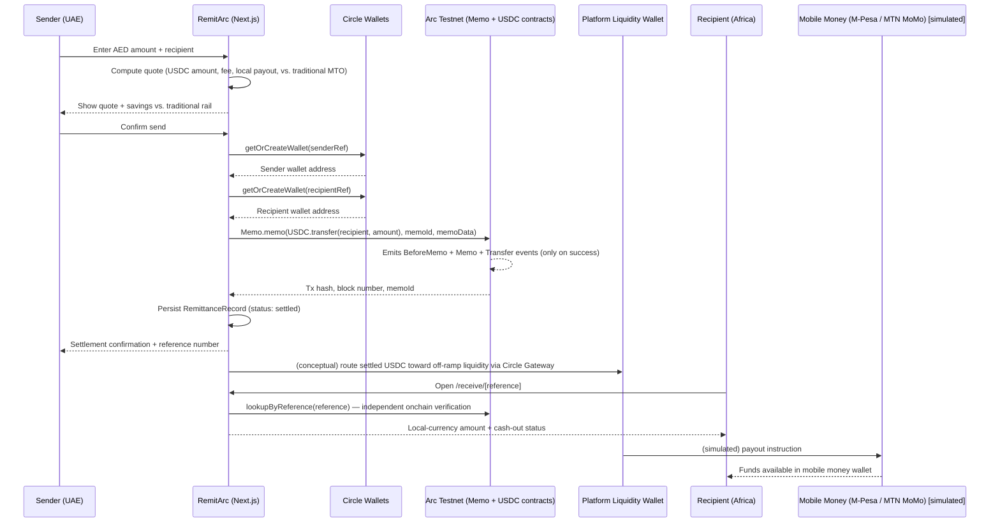

# RemitArc — Architecture

## Corridor: UAE → Africa (Kenya, Nigeria, Uganda, Egypt at launch)

## End-to-end flow

## Component responsibilities

- **Circle Wallets (Developer-Controlled)** — gives both sender and recipient an embedded, custodied wallet keyed by email/phone. Neither party ever sees a private key or seed phrase. Until live Circle credentials are configured, `lib/circle.ts` returns deterministic mock wallets so the rest of the flow is fully demoable.
- **Arc Testnet + Memo contract** — the settlement layer. Every transfer is wrapped through the predeployed `Memo` contract (`0x5294E9927c3306DcBaDb03fe70b92e01cCede505`) so that the underlying `USDC.transfer` call and a structured reference (`memoId` + free-text memo bytes) are recorded atomically — the memo event only fires if the transfer itself succeeds. This is what makes every RemitArc transfer independently reconcilable: anyone with the reference number can re-derive the `memoId` (`keccak256(reference)`) and query Arc directly for proof, without trusting RemitArc's own database.
- **Platform liquidity wallet** — represents where Circle Gateway would sit in a production build: a treasury-side wallet that aggregates settled USDC and would route it toward an actual fiat/mobile-money off-ramp partner. In this hackathon build, the off-ramp step itself is simulated (no live mobile money payout API integrated), but the architecture seam (`lib/circle.ts` future `routeToOffRamp()` function) is where Gateway calls would be added.
- **FX/quote engine** (`lib/fx.ts`) — static, clearly-labeled reference data per corridor (AED↔USDC, AED↔local currency, typical traditional-rail fee %, typical settlement time) used to generate the side-by-side savings comparison shown to the sender before they confirm. Flagged in code as illustrative placeholders to replace with sourced figures before recording the submission video.
- **Transaction store** (`lib/store.ts`) — a JSON-file-backed record per remittance (sender ref, recipient ref, amounts, status, tx hash, memo ID). This is the off-chain index for the dashboard UI; the *source of truth* for "did this transfer happen" is always the onchain Memo event, not this file.

## Where StableFX would fit (conceptual — gated/Enterprise, not requested this cycle)

A production version of the AED→local-currency leg above is itself an FX trade (AED → USDC → KES/NGN/UGX/EGP). **StableFX** is the natural slot for FX-aware, multi-currency settlement routing rather than RemitArc hand-rolling static rate tables (`lib/fx.ts`) as a stand-in. We did not request Enterprise access for this submission window, per the challenge rules allowing conceptual/architecture-level treatment of gated tools without penalty.

## Where CCTP / Bridge Kit would fit (stretch, not required for the demo)

If a recipient's mobile money off-ramp partner settles on a different chain than Arc, **CCTP with Bridge Kit** would move the USDC cross-chain before the final off-ramp hop, instead of relying on a custodial bridge. Not implemented in this build since the corridor's off-ramp is simulated, but noted as the correct extension point.

## Security & trust notes

- Sender and recipient never hold private keys directly (Circle Wallets custody).
- The platform's own `PLATFORM_PRIVATE_KEY` (used to call `Memo.memo` during the hackathon build) should, in a production system, be replaced by a Circle Developer-Controlled Wallet itself, removing any raw private key from the app's environment entirely.
- Every transfer is reconcilable independent of RemitArc's own infrastructure — a sender, recipient, or auditor can verify settlement directly against Arc using only the reference number.
